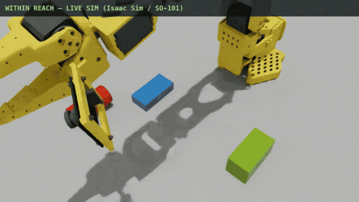

# Within Reach

**An assistive robotic system that brings everyday objects within reach.**

Ask for an object you cannot safely or independently reach. The SO-101 arm
identifies anything blocking the way, relocates those obstacles, delivers the
requested object to an accessible reach zone, and verifies that it arrived
successfully.

Designed to support people with limited mobility, Within Reach connects
perception, planning, and physical action beyond a scripted pick-and-place
task. The current prototype is demonstrated in a kitchen-like environment,
but the same system can be used anywhere someone may need help retrieving
objects from a table, shelf, or shared workspace.



Built for the NVIDIA Physical AI Sprint Hackathon. It runs in Isaac Sim through
[Antioch](antioch.yaml) and on a physical SO-101 over USB using the same planner
and phase machine.

---

## How it works

The challenging part of assistive object retrieval is not simply grasping an
object. It is recognizing that the requested item is blocked, deciding how to
clear a safe path, and recovering if an action fails.

Nothing in the code explicitly says “move the cup.” The planner uses a LIFO
goal stack. When the goal *deliver the medicine* is blocked, it pushes
*relocate the blocker* onto the stack, completes that sub-goal, and then resumes
the original delivery goal. The cup-moving behavior emerges from a small set
of planning and monitoring components:

| Piece | What it does | Where |
|---|---|---|
| **Goal stack** | Push/pop sub-goals; retry on failure; depth and expansion caps so mutually-blocking objects can't nest forever | `planner.py` → `Planner` |
| **Blocker detection** | Point-to-segment distance against the gripper→target corridor, plus a clearance check at the drop point | `planner.py` → `find_blockers` |
| **Free-spot search** | Rejection-sample a placement point with clearance from every object and every keep-out circle | `planner.py` → `find_free_spot` |
| **Physics gates** | Per-phase pass/fail on ground truth — lift height, carry distance, tilt, settle speed | `monitor.py` |

`planner.py`, `monitor.py` and `arm_ik.py` are pure Python with **zero
dependencies** and self-tests in `__main__`. You can watch the whole reasoning
loop without a simulator:

```bash
python3 planner.py    # prints: relocate cup, then move medicine
python3 monitor.py
python3 arm_ik.py
python3 executor.py   # full phase machine against a fake arm
```

## The claim

The eval runs the same seeds, the same scenes, and the same manufactured grasp
offset twice — once with the supervisor off (naive execution, no blocker
reasoning, no retries) and once with it on. The gap between the two pass rates
is the result.

```bash
.venv/bin/antioch suite run kitchen
```

One scenario declaration expands into both cases (`sup-False`, `sup-True`).
Every episode ends in `run.check()`, so a judge can click into the result rather
than read a number off a slide. The checks gate the *validity* of the
experiment — that the manufactured failure fired, that blocked scenes were
staged, that a usable review frame was published — never the desirability of the
outcome, because the baseline is supposed to score badly.

Reported per case: `success_rate`, `blocked_delivered`, `recovered`,
`relocations`, plus per-episode detail and PNG artifacts of the scene.

## Architecture

```
        language layer                    "bring me the medicine"
              │
              ▼
        planner.py            goal stack · blocker detection · free-spot search
              │  Goal(obj, to_xy)
              ▼
        executor.py           approach → grasp → lift → carry → place
              │                 monitor.py checks physics after every phase
              ├──────────────┬──────────────────┬─────────────────┐
              ▼              ▼                  ▼                 ▼
        SimBackend      RealBackend        FakeBackend       ROS 2 node
        (Isaac)         (SO-101 / USB)     (pure Python)     (rclpy topics)
```

`executor.run_goal()` is the single seam between reasoning and action. The phase
sequence and the gates live there, shared by every backend, because *"approach,
grasp, lift, carry, place, check after each"* is a property of the task and not
of the hardware. Only four primitives — `send`, `measured`, `state_for`,
`dwell` — differ per backend. Same planner, same phases, same gates: one runs on
a GPU in the cloud, one runs on the table in front of you.

The ROS 2 package is a fourth consumer of that same seam rather than a port of
anything. `ros2/src/within_reach/within_reach/bridge.py` holds the logic and
imports no ROS at all, so it is testable on a machine with no ROS installed;
`kitchen_node.py` is a thin rclpy wrapper over it.

## Running it

### Simulation (Antioch / Isaac Sim)

```bash
cd ~/my-sim && uv sync
.venv/bin/antioch auth login

# Warm the machine — a cold one stalls ~25 s on the first render
.venv/bin/antioch scenario run --scenario so101_render_probe

# Asset and kinematics recon
.venv/bin/antioch scenario run --scenario kitchen_probe
.venv/bin/antioch scenario run --scenario tool_calibration

# The eval
.venv/bin/antioch suite run kitchen
.venv/bin/antioch scenario run --scenario kitchen -p supervisor_on=false
```

Use `~/my-sim/.venv/bin/antioch` from `~/my-sim` — a bare `antioch` in `PATH`
is a different binary.

### Physical SO-101

Every run is a dry run until `--live` is passed. Keep a hand near the power
switch on first motion.

```bash
python3 bus_monitor.py                     # which servos are answering
python3 calibrate_sweep.py --seconds 45    # unwrapped range-of-motion recording
python3 taught_arm.py --teach pick_cup --seconds 6
python3 taught_arm.py --demo               # planner-driven, taught poses
python3 real_backend.py --probe            # IK path: read joints, move nothing
python3 real_backend.py --map              # discover sign + offset per joint
```

Two paths to the hardware, deliberately:

- **`taught_arm.py`** replays hand-taught poses verbatim. No number is ever
  converted between the twin's radians and lerobot's calibrated degrees, so no
  conversion mistake can become a full-speed swing. The planner still decides
  what moves and in what order — it just picks from labelled poses.
- **`real_backend.py`** drives from `arm_ik.py` and accepts arbitrary Cartesian
  targets. It needs the radians↔degrees correspondence established first,
  which is what `--map` is for.

### ROS 2 node

Drives `FakeBackend`, so no hardware or GPU is involved.

```bash
./ros2/run_in_docker.sh          # build, launch, send a command, print the topics
```

| direction | topic | type |
|---|---|---|
| sub | `/within_reach/command` | `std_msgs/String` |
| pub | `/within_reach/plan` | `std_msgs/String` |
| pub | `/within_reach/event` | `std_msgs/String` |
| pub | `/joint_states` | `sensor_msgs/JointState` |

`/joint_states` keeps its conventional name so `rviz2`, `rqt_plot` and
`ros2 bag record` work without configuration. The logic alone, without ROS:

```bash
python3 ros2/src/within_reach/within_reach/bridge.py
```

## Repo layout

| File | |
|---|---|
| `planner.py` | Goal stack, blocker detection, free-spot search. Zero deps, self-tested. |
| `monitor.py` | Per-phase physics gates and thresholds. Zero deps, self-tested. |
| `arm_ik.py` | Exact SO-101 kinematics — product of exponentials over axis lines **measured** off the calibrated twin, not taken from a drawing. |
| `executor.py` | Phase machine and the `ArmBackend` protocol shared by sim, hardware, and the fake. |
| `src/kitchen.py` | The eval scenario that produces the headline number. |
| `src/probe.py` | Asset, camera, encoder and tool-calibration recon scenarios. |
| `src/scenarios.py`, `src/main.py` | Engine smoke checks and the parameter sweep. |
| `real_backend.py` | `ArmBackend` on the physical arm via lerobot. |
| `taught_arm.py` | Teach-and-replay executor; the safe hardware path. |
| `calibrate_sweep.py` | Range-of-motion recorder that unwraps encoder rollover. |
| `bus_monitor.py` | Live view of the half-duplex servo bus. |
| `ros2/src/within_reach/` | ROS 2 package: `bridge.py` (no ROS imports, self-tested) and `kitchen_node.py` (rclpy). |
| `ros2/run_in_docker.sh` | Builds and exercises the node in `ros:humble`, start to finish. |
| `kitchen_suite.py` | Original pre-console scaffold, kept for history. `src/kitchen.py` superseded it. |
| `RUNBOOK.md` | Launch runbook, roles, gates, known traps (Russian). |
| `DESCRIPTION.md` | Why this task and not the other one (Russian). |

## Things that were measured, not assumed

The comments in this repo are mostly a record of things that looked right and
were not:

- The first `arm_ik.py` modelled the arm as a planar chain. It round-tripped
  `forward(solve(p)) == p` to nanometres and was **wrong by 380 mm** against the
  twin. A self-consistent model is not a correct one; `tool_calibration` is what
  caught it.
- The scaffold's `(0.10, 0.50)` workspace was roughly half fiction. Measured
  reach at 20 mm above the table is `x ≤ 0.300`, `|y| ≤ 0.250`.
- The hackathon blocks ship **zero colliders**, so held objects ride the tool tip
  kinematically instead of being held by friction.
- `set_camera_view` framed the workspace at 0.13% of the frame while every
  exposure check stayed green. `camera_framing` re-measured it to 16%.
- lerobot's own `record_ranges_of_motion()` reads raw encoder counts and returns
  `0..4095` whenever a joint's travel crosses the wrap boundary — which two of
  these joints do. `calibrate_sweep.py` unwraps instead.
